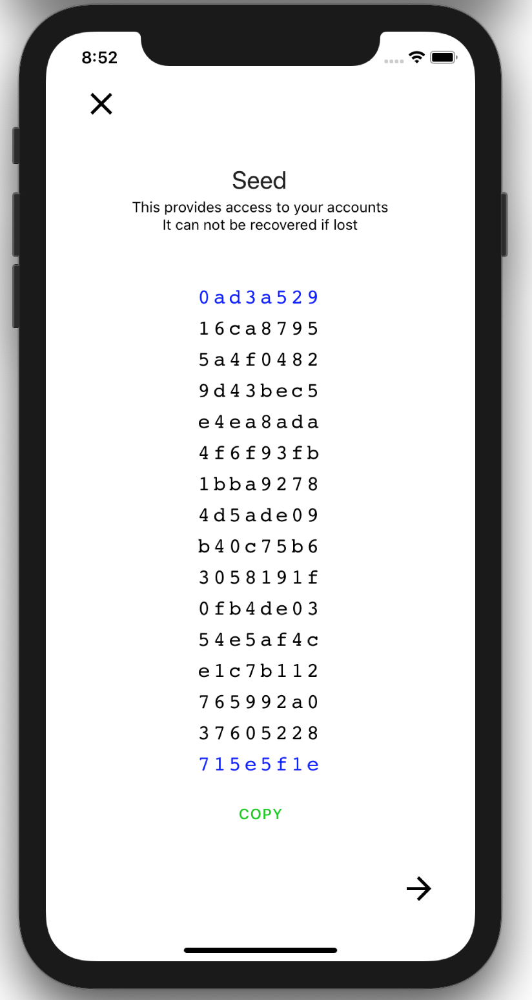
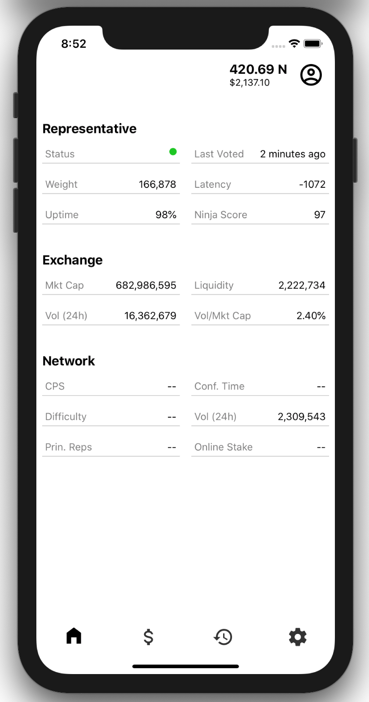
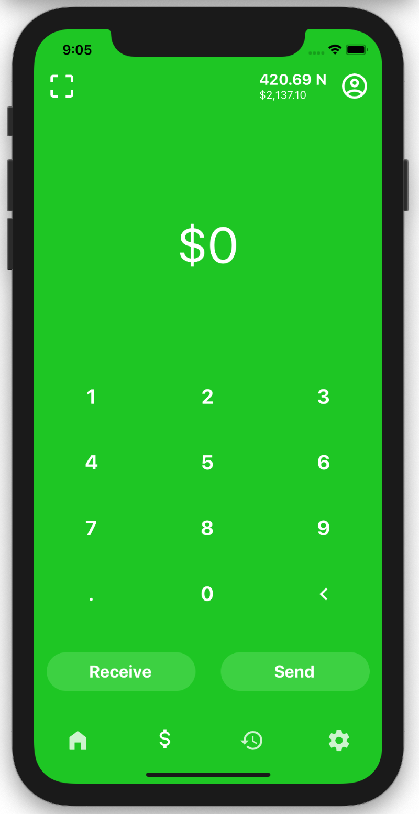
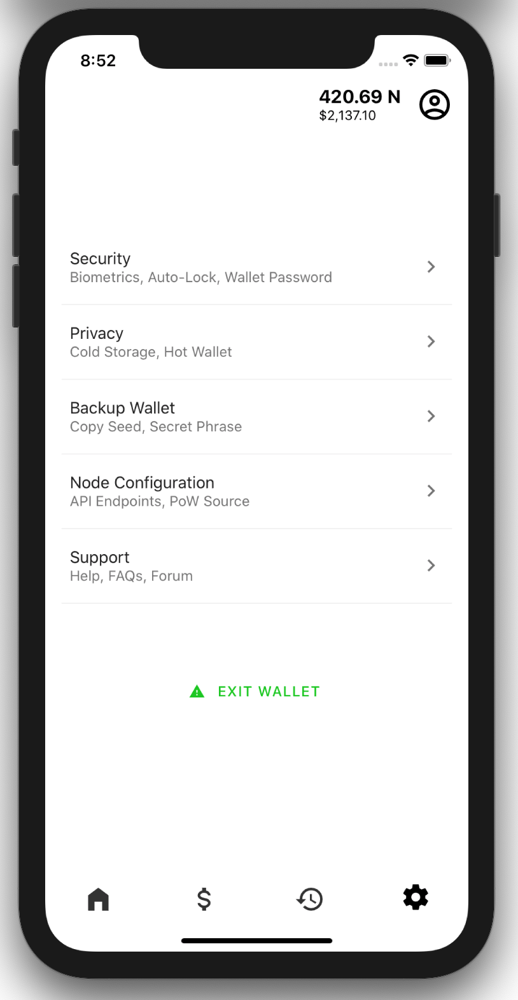
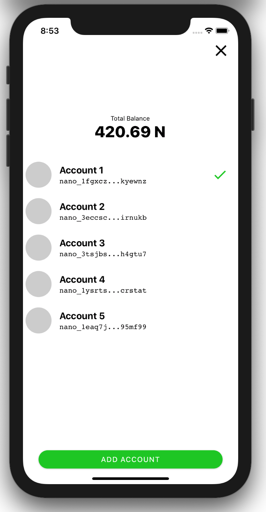

# NANO Wallet (working title)

> Desktop, iOS and Android wallet for Nano

NANO wallet is a proof of concept wallet for the Nano cryptocurrency project. This project aims to explore self-custody strategies with layer two and wallet based privacy solutions.

## Demo

  

## Screenshots

