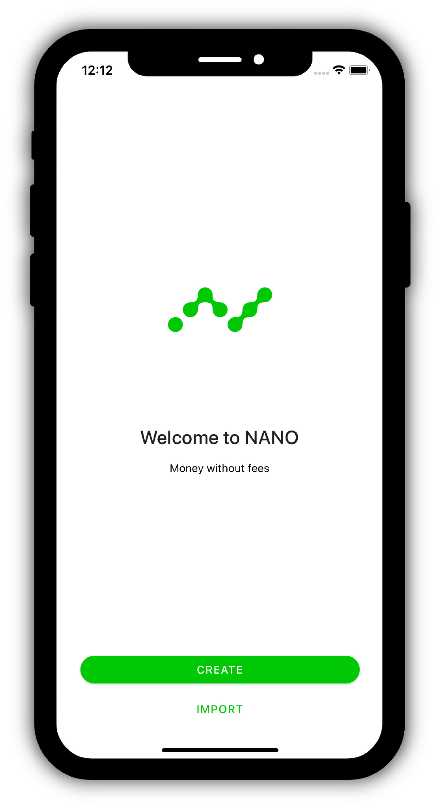
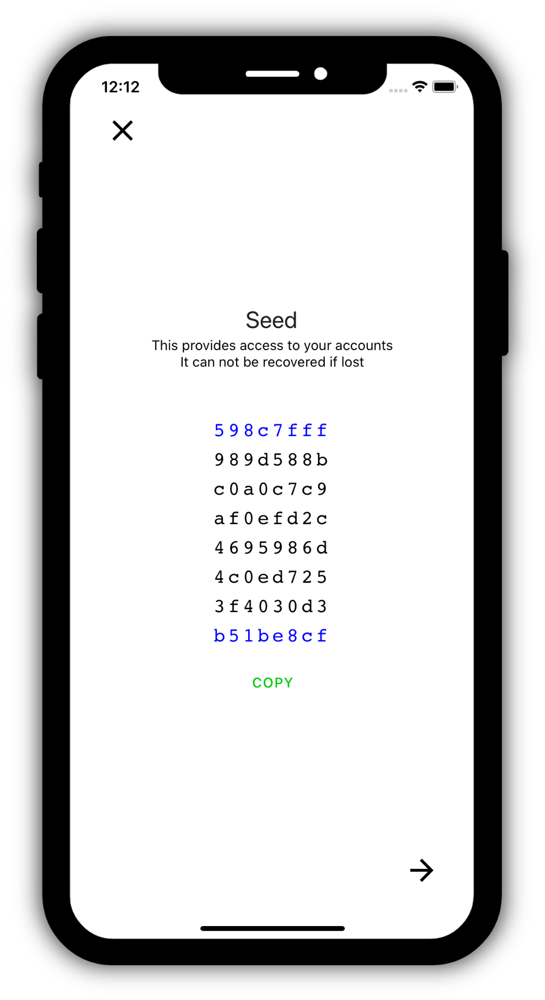
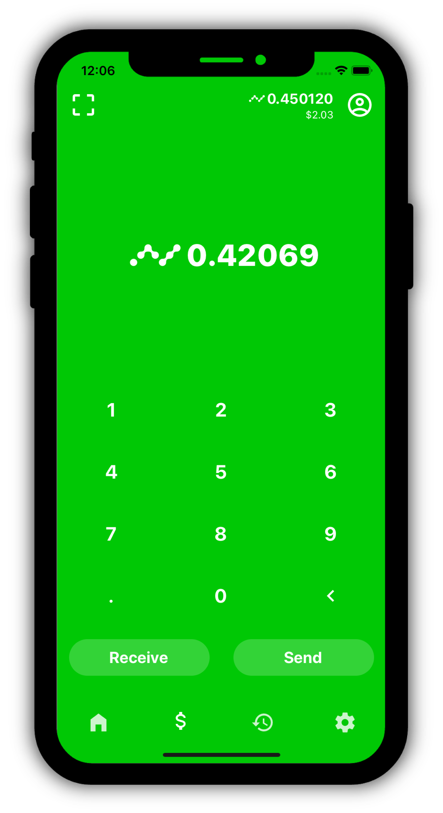
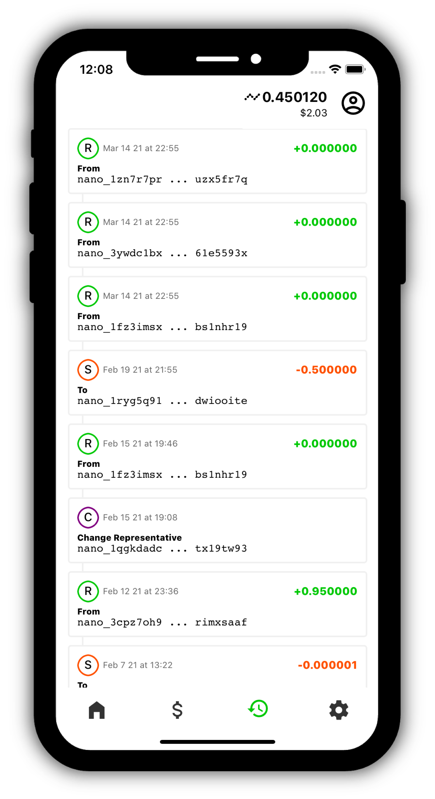
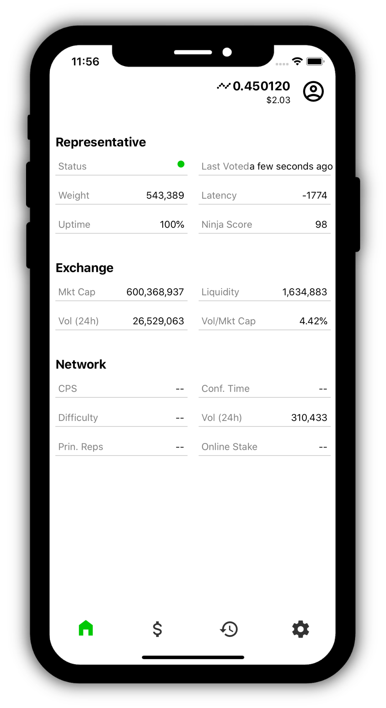
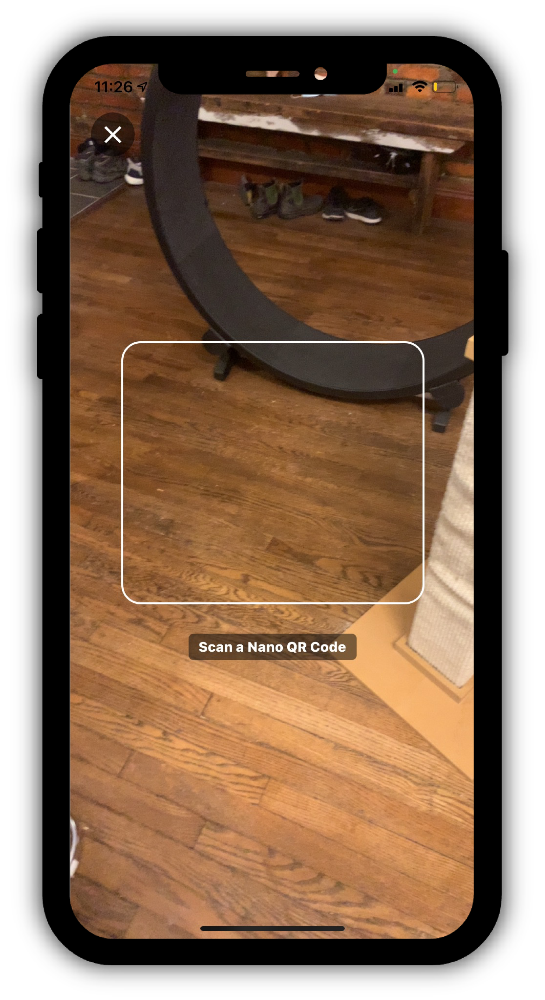
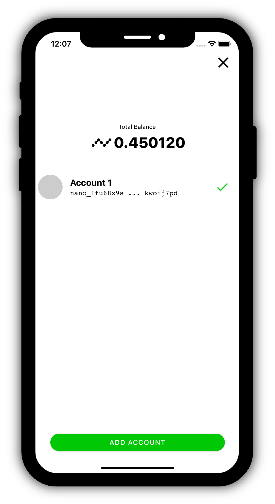
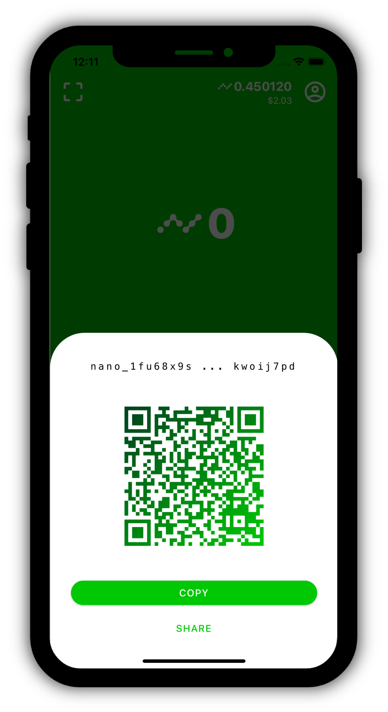
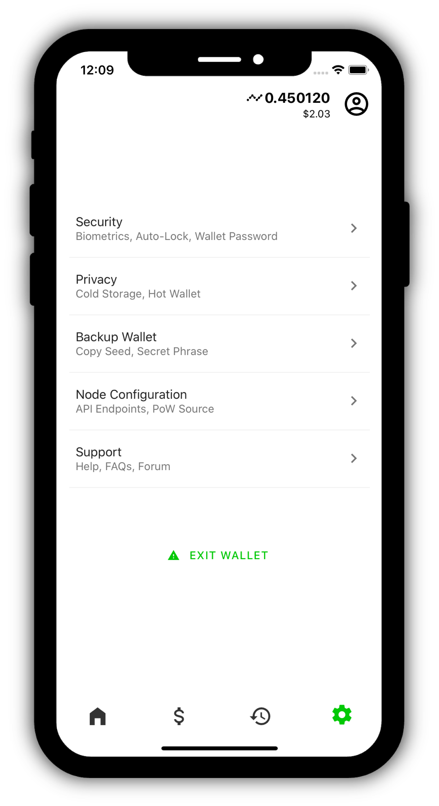

<h1 align="center">Nanny Pack</h1>

> Desktop, iOS and Android wallet for Nano

  

This is a proof of concept wallet for the [Nano cryptocurrency protocol](https://github.com/nanocurrency/nano-node). This project aims to explore self-custody strategies with a focus on privacy and ease of use.

### Features
- [x] Supports [BIP32](https://github.com/bitcoin/bips/blob/master/bip-0032.mediawiki)/[39](https://github.com/bitcoin/bips/blob/master/bip-0039.mediawiki)/[44](https://github.com/bitcoin/bips/blob/master/bip-0044.mediawiki), Blake2b
- [x] Import Seed, Private Key, or Mnemonic phrase
- [x] Export Seed, or Mnemonic phrase
- [x] Qr Reader / Generator
- [ ] Key Encryption at rest (Password or Biometrics)
- [ ] Single Use / Private Receive Management
- [ ] Trustless Mixing
- [ ] Representative Management
- [ ] Transaction Memos
- [ ] Watch Addresses

 
 
 

## Screenshots

## Demo

  

